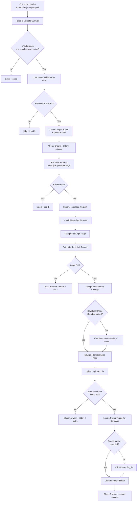

# Design Document: bundle-automation

## Overview

`bundle-automation.js` is a Node.js CLI script that automates the full end-to-end workflow of building a SpiraApp package and deploying it to a Spira instance. It wraps two distinct phases:

1. **Build phase** — reuses the packaging logic from `index.js` to produce a `.spiraapp` file from a source folder.
2. **Deploy phase** — uses Playwright to drive a Chromium browser session: log in to Spira, enable Developer Mode, upload the `.spiraapp` file, and activate the SpiraApp system-wide via its power toggle.

The script is invoked with a single `--input` CLI argument. The output folder is derived automatically by appending `"Bundle"` to the input folder name. Credentials and the Spira base URL are loaded from a `.env` file, keeping sensitive values out of source control.

---

## Architecture



The script is a single-file Node.js module. It imports the `package` export from `index.js` (refactored to be callable without side effects) and uses Playwright's `chromium` launcher for browser automation.

---

## Components and Interfaces

### 1. CLI Argument Parser

Responsible for extracting and validating the `--input` argument from `process.argv`.

```js
// Returns { inputFolder: string } or exits with error
function parseArgs(argv: string[]): { inputFolder: string }
```

- Uses a simple loop over `process.argv` looking for `--input=<value>` or `--input <value>` patterns.
- Exits with code 1 and a message to stderr if `--input` is absent, empty, or the resolved folder lacks `manifest.yaml`.

### 2. Output Folder Deriver

```js
// e.g. "/path/to/AIConnect" → "/path/to/AIConnectBundle"
function deriveOutputFolder(inputFolder: string): string
```

Uses `path.basename` and `path.dirname` to construct the sibling `<name>Bundle` directory.

### 3. Build Runner

Wraps the call to `index.js`'s packaging logic. Because `index.js` currently calls `exports.package()` at module load time and reads paths from `process.env.npm_config_input/output`, the build runner will:

- Temporarily set `process.env.npm_config_input` and `process.env.npm_config_output` before requiring/calling the build logic.
- Capture console output to detect errors (error count > 0 → exit).
- Resolve the produced `{guid}.spiraapp` file path from the output folder after the build.

```js
// Returns path to the produced .spiraapp file, or throws on error
async function runBuild(inputFolder: string, outputFolder: string): Promise<string>
```

### 4. Environment Loader

```js
// Loads .env and validates required vars; exits on missing vars
function loadEnv(): { baseUrl: string, username: string, password: string }
```

Uses `dotenv.config()`. Checks for `SPIRA_BASE_URL`, `SPIRA_USERNAME`, `SPIRA_PASSWORD`. Never logs the password value.

### 5. Playwright Automation Controller

Encapsulates all browser interactions. Accepts the env config and the `.spiraapp` file path.

```js
async function runAutomation(config: EnvConfig, spiraappPath: string): Promise<void>
```

Internal steps (each as a focused async helper):

| Helper | Responsibility |
|---|---|
| `login(page, config)` | Navigate to login page, fill credentials, submit, verify success |
| `enableDeveloperMode(page, config)` | Navigate to General Settings, check state, enable if needed, save |
| `uploadSpiraApp(page, spiraappPath)` | Navigate to SpiraApps admin page, use `.spiraapp` file input, upload |
| `verifyUpload(page, appName)` | Poll SpiraApps list for the uploaded app (30 s timeout) |
| `activateSpiraApp(page, appName)` | Locate power toggle, click if disabled, confirm enabled state |

### 6. Error Handler / Cleanup

A `try/finally` block in `runAutomation` ensures `browser.close()` is always called, regardless of success or failure.

---

## Data Models

### EnvConfig

```js
{
  baseUrl: string,   // SPIRA_BASE_URL — trailing slash normalised
  username: string,  // SPIRA_USERNAME
  password: string   // SPIRA_PASSWORD — never logged
}
```

### BuildResult

```js
{
  spiraappPath: string,  // absolute path to the produced {guid}.spiraapp file
  appName: string        // SpiraApp name from manifest.yaml (used to find it in the UI list)
}
```

### CLIArgs

```js
{
  inputFolder: string   // resolved absolute path to the input folder
}
```

---

## Correctness Properties

*A property is a characteristic or behavior that should hold true across all valid executions of a system — essentially, a formal statement about what the system should do. Properties serve as the bridge between human-readable specifications and machine-verifiable correctness guarantees.*

### Property 1: Output folder name derivation

*For any* valid input folder path string, the derived output folder path SHALL equal `path.join(path.dirname(input), path.basename(input) + "Bundle")`.

**Validates: Requirements 2.1**

### Property 2: Missing or empty `--input` always exits non-zero

*For any* `process.argv` array that either omits `--input` entirely or supplies it with an empty value, the argument parser SHALL produce a non-zero exit and write a non-empty message to stderr.

**Validates: Requirements 1.2**

### Property 3: Missing manifest always exits non-zero

*For any* input folder path that resolves to a directory without a `manifest.yaml` file, the script SHALL exit with a non-zero exit code and write a descriptive message to stderr.

**Validates: Requirements 1.3**

### Property 4: Any missing env var exits non-zero and names it

*For any* non-empty subset of `{SPIRA_BASE_URL, SPIRA_USERNAME, SPIRA_PASSWORD}` that is absent from the environment, the script SHALL exit with a non-zero exit code and include each missing variable's name in the stderr output.

**Validates: Requirements 4.2**

### Property 5: Password value never appears in output

*For any* string value assigned to `SPIRA_PASSWORD`, that exact string SHALL NOT appear in any data written to stdout or stderr across any execution path (success or failure).

**Validates: Requirements 4.3**

### Property 6: Build errors prevent browser launch

*For any* `manifest.yaml` that causes the build process to report one or more validation errors, the script SHALL exit with a non-zero exit code and `playwright.chromium.launch()` SHALL NOT be called.

**Validates: Requirements 3.2**

### Property 7: Browser session always closed on exit

*For any* execution that reaches the browser automation phase — whether it completes successfully, encounters a login failure, an upload timeout, or any unhandled error — the Playwright browser session SHALL be closed before the process exits.

**Validates: Requirements 9.2, 9.3**

### Property 8: Login URL correctly derived from base URL

*For any* value of `SPIRA_BASE_URL` (with or without a trailing slash), the login page URL constructed by the script SHALL be a valid URL that begins with the normalised base URL and ends with the expected login path segment.

**Validates: Requirements 5.1**

---

## Error Handling

| Failure Point | Behaviour |
|---|---|
| `--input` absent or empty | Print to stderr, `process.exit(1)` |
| `manifest.yaml` not found | Print to stderr, `process.exit(1)` |
| Missing env var(s) | Print each missing var name to stderr, `process.exit(1)` |
| Build validation errors | Print errors to stderr, `process.exit(1)` — no browser launched |
| Login failure | Close browser, print to stderr, `process.exit(1)` |
| Upload timeout (>30 s) | Close browser, print to stderr, `process.exit(1)` |
| Any unhandled Playwright error | `finally` block closes browser, error propagates to top-level handler which prints to stderr and calls `process.exit(1)` |
| Success | Print success message to stdout, `process.exit(0)` |

All error messages include enough context to diagnose the problem (e.g. which variable is missing, which URL was unreachable) without ever printing `SPIRA_PASSWORD`.

---

## Testing Strategy

### Unit Tests

Focus on the pure, synchronous logic that can be tested without a browser or a real Spira instance:

- `parseArgs` — valid input, missing `--input`, empty value, `manifest.yaml` absent
- `deriveOutputFolder` — various path shapes (trailing slash, Windows-style, relative)
- `loadEnv` — all vars present, each var missing individually, all vars missing
- Password redaction — assert `SPIRA_PASSWORD` value never appears in any captured stderr/stdout

Use Node's built-in `assert` module or a lightweight test runner (e.g. `node:test`).

### Property-Based Tests

Property-based testing is applicable here for the pure derivation and validation logic. Use [fast-check](https://github.com/dubzzz/fast-check) (JavaScript PBT library).

Each property test runs a minimum of **100 iterations**.

Tag format: `// Feature: bundle-automation, Property <N>: <property_text>`

| Property | Test description |
|---|---|
| Property 1 | Generate arbitrary valid path strings; assert `deriveOutputFolder(p)` equals `path.join(path.dirname(p), path.basename(p) + 'Bundle')` |
| Property 2 | Generate argv arrays without `--input` or with empty value; assert `parseArgs` exits non-zero and stderr is non-empty |
| Property 3 | Generate paths to folders without `manifest.yaml`; assert script exits non-zero with stderr message |
| Property 4 | Generate all non-empty subsets of `{SPIRA_BASE_URL, SPIRA_USERNAME, SPIRA_PASSWORD}` as missing; assert exit non-zero and each missing var name appears in stderr |
| Property 5 | Generate arbitrary password strings; run script through various code paths; assert password value never appears in stdout or stderr |
| Property 6 | Generate manifests with injected validation errors; assert script exits non-zero and `chromium.launch()` is never called |
| Property 7 | Simulate errors thrown at various points in the automation flow; assert `browser.close()` is always called before process exit |
| Property 8 | Generate base URLs with/without trailing slashes and various path prefixes; assert constructed login URL starts with normalised base URL and ends with the expected login path |

### Integration / End-to-End Tests

These require a real (or locally mocked) Spira instance and are not suitable for property-based testing:

- Full happy-path run against a test Spira instance
- Login failure with wrong credentials
- Upload of a valid `.spiraapp` file and verification it appears in the list
- Power toggle already enabled — verify script does not double-toggle

These are run manually or in a CI environment with access to a Spira test instance.
